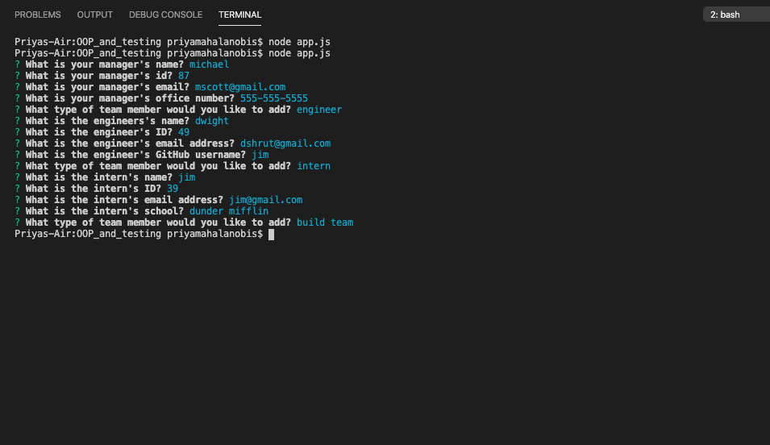
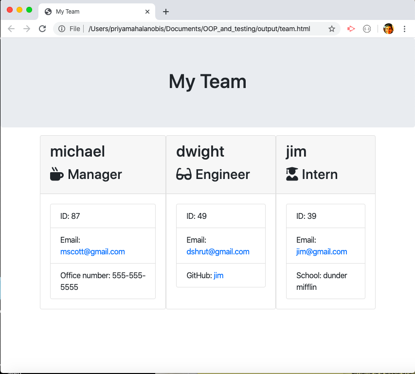

# OOP + Constructors "Team Building" Assignment

### GH Pages URL:  https://pmahalan.github.io/OOP_and_testing/

The purpose of this assignment was to use constructor functions so that upon running the CLI, the user has the ability to create as many "people" as desired of varying types (engineer, intern, and/or manager) as they want, prior to executing "build team". The application's goal is to build an imaginary "team" of people as in a company; some of the roles within the company include managers, engineers and interns. Rather than having a certain number of people (and their information) hard-coded, however, I wanted to build a CLI which would enable the user to dynamically create their own team. Through the use of constructor functions for interns, engineers and managers -- each of which extend the "employee" constructor -- the user is able to create information for as many people as they want on the team. 

Upon typing and entering "node app.js" into the command line, the user is asked what kind of employee they'd like to add to the team. This is done with the "inquirer" node package. The user selects one of three choices presented to them (engineer, intern or manager). Upon selecting which type of employee they'd like to add, they input information the constructors ask for (i.e. name, email address, office number, school, and github username). Once they've input information for each item in the constructor, inquirer will ask them if they would like to create another person or "build team". Once the user is satisfied with the people they've created, selecting "build team" exports the information of the new team they've created as an HTML file to a directory called "output". When the user opens this HTML page in a browser, they are able to view a webpage with cards containing each person's information!

